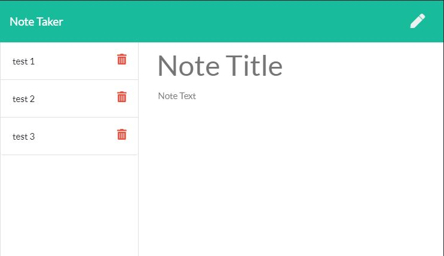
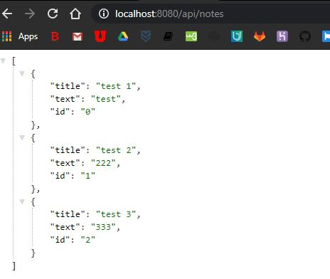
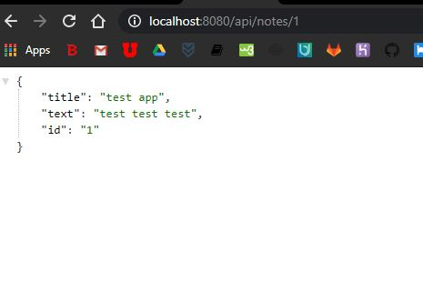

# Note-Taker

Repository: https://github.com/aarkitekkt/note-taker

Deployed: https://aarkitekkt-notes.herokuapp.com/

## Overview
​
The purpose of this application is to allow the user to write down notes which are saved to a database and shown on the application. 
​
### Gallery
​
Prompts:

API:

​
Select by ID:

Adding a note:

​
### Problem

The biggest challenge faced with this application was dynamically updated the database array as new notes are added and deleted using the app.  

### Solution
​
My initial solution allowed the user input on the app to dynamically update the database, however, the html would not update to reflect the changes to the database.  The cause of this problem was not haveing the database variable be re defined after user input was submitted.  When the javascript funtion to render the note list would run after a new note was added, the database would still reflect the data as it existed when the page was first loaded.  

The solution was to add a "fs.readfile" function to the GET API endpoint so that the most current database would be read and sent back to the client to render the current list of notes.

## Tech and Features Used
​
* Node JS
* Express
​
## How to use
​
From the home page, click the 'get started' button to navigate to the notes page.  To add a note, enter your title and note into the fields and click the save icon. To view a previous note, click on the note title from the list to display the note.  To delete a note, click the red delete icon.
​
## Technical Overview
​
1. 
